# Walgo Architecture

This document provides a comprehensive overview of Walgo's architecture, design patterns, and internal structure.

## Table of Contents

- [High-Level Overview](#high-level-overview)
- [Architecture Diagram](#architecture-diagram)
- [Core Components](#core-components)
- [Deployment Flow](#deployment-flow)
- [Data Flow](#data-flow)
- [Design Patterns](#design-patterns)
- [Package Structure](#package-structure)

## High-Level Overview

Walgo is a CLI tool that bridges Hugo static site generation with Walrus decentralized storage. It provides:

1. **Hugo Integration** - Initialize, build, and serve Hugo sites
2. **Asset Optimization** - Minify and optimize HTML, CSS, and JavaScript
3. **Dual Deployment Modes** - HTTP (free) and on-chain (permanent) deployment
4. **Content Import** - Import from Obsidian vaults
5. **Site Management** - Update and monitor deployments

## Architecture Diagram

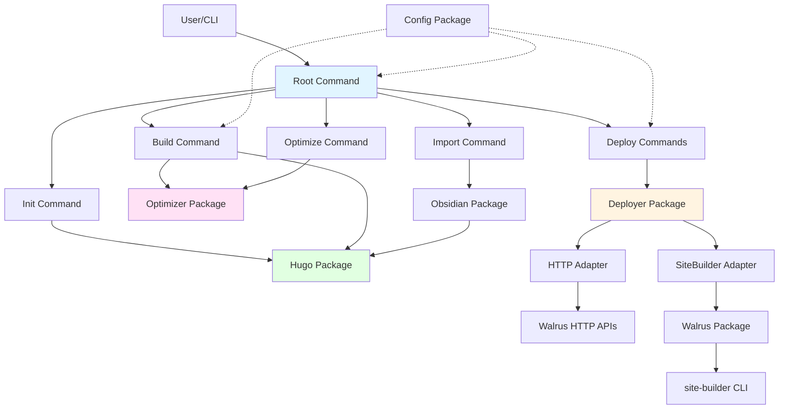

## Core Components

### 1. Command Layer (`cmd/`)

The command layer implements the CLI interface using Cobra framework:

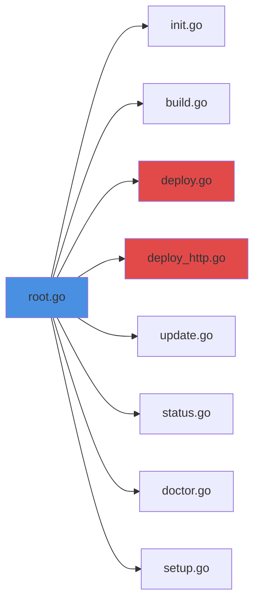

**Key Commands:**

| Command | Purpose | Dependencies |
|---------|---------|--------------|
| `init` | Create new Hugo site | Hugo package |
| `build` | Build Hugo site + optimize | Hugo, Optimizer, Config |
| `deploy` | On-chain deployment | Deployer (SiteBuilder), Config, Walrus |
| `deploy-http` | HTTP deployment | Deployer (HTTP), Config |
| `update` | Update existing site | Walrus package |
| `status` | Check deployment status | Walrus package |
| `doctor` | System diagnostics | Config, Hugo, Walrus |
| `optimize` | Asset optimization | Optimizer package |
| `import` | Obsidian import | Obsidian, Hugo |

### 2. Hugo Integration (`internal/hugo/`)

Manages Hugo site lifecycle:

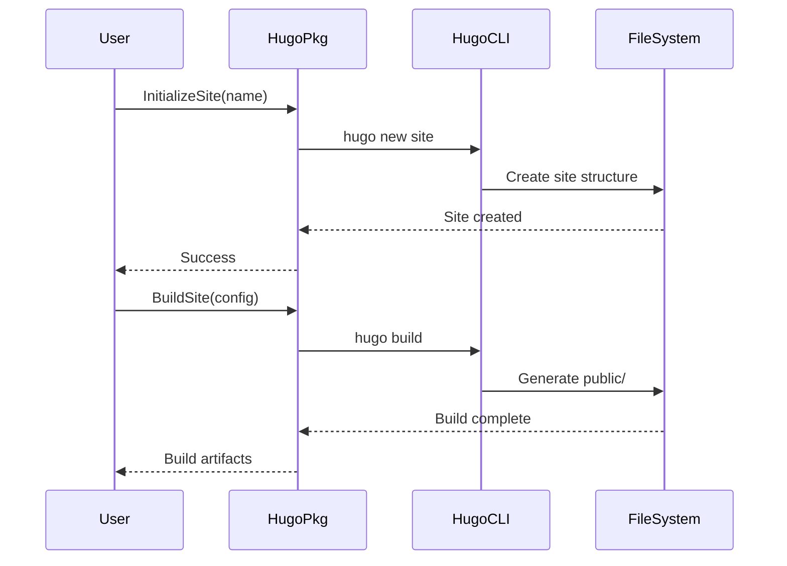

**Functions:**
- `InitializeSite(name string)` - Create new Hugo site
- `BuildSite(config *HugoConfig)` - Build Hugo site
- `ServeSite(config *HugoConfig)` - Run local development server
- `DetectHugoConfig(dir string)` - Find Hugo configuration

### 3. Optimizer Engine (`internal/optimizer/`)

Multi-stage asset optimization pipeline:

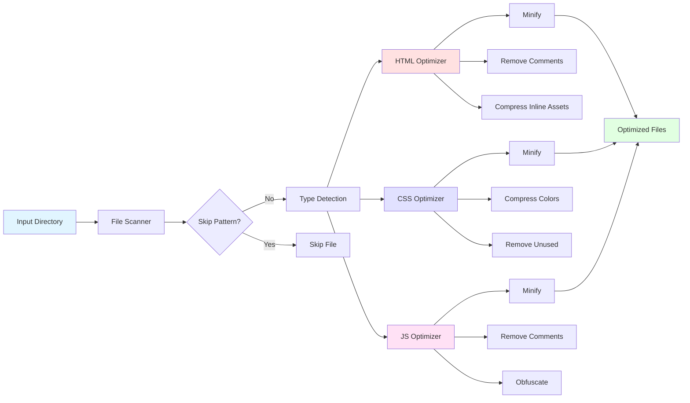

**Optimization Stages:**

1. **File Discovery** - Scan directory recursively
2. **Pattern Filtering** - Skip `.min.js`, `.min.css`, etc.
3. **Type Detection** - Identify HTML, CSS, JS by extension
4. **Optimization** - Apply type-specific optimizations
5. **Statistics** - Track bytes saved, files processed

**Key Features:**
- Preserves conditional comments in HTML
- Handles inline styles and scripts
- Safe string/regex handling in JavaScript
- Color compression in CSS
- Configurable skip patterns

### 4. Deployer Abstraction (`internal/deployer/`)

Adapter pattern for multiple deployment backends:

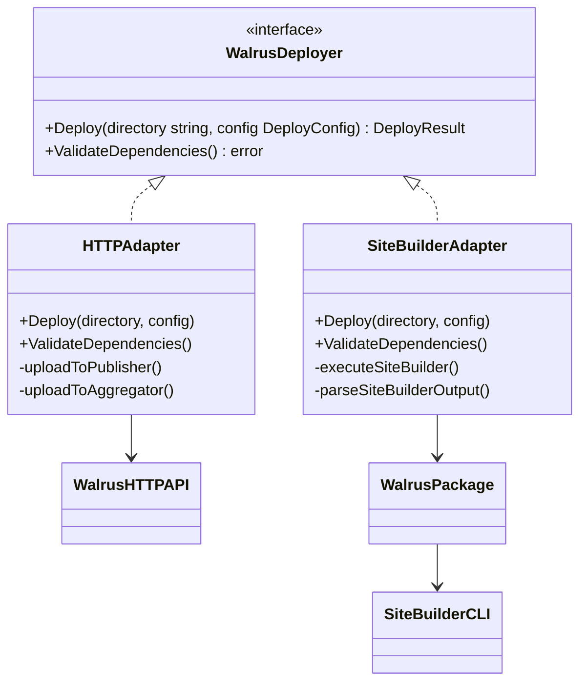

**Deployment Modes:**

| Mode | Adapter | Requirements | Permanence |
|------|---------|--------------|------------|
| HTTP | HTTPAdapter | None | Temporary (30 days) |
| On-Chain | SiteBuilderAdapter | Sui wallet + SUI tokens | Permanent (epochs) |

### 5. Walrus Integration (`internal/walrus/`)

Wrapper around Walrus site-builder CLI:

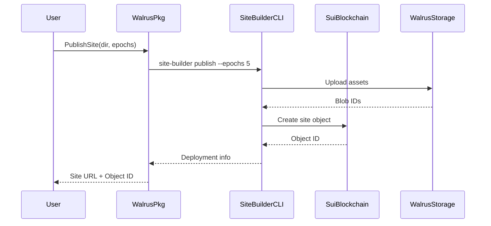

**Functions:**
- `PublishSite(dir, epochs)` - Deploy new site
- `UpdateSite(objectID, dir)` - Update existing site
- `GetSiteStatus(objectID)` - Check deployment status
- `ParseSiteBuilderOutput(output)` - Extract object IDs and URLs

### 6. Configuration Management (`internal/config/`)

Multi-source configuration with Viper:

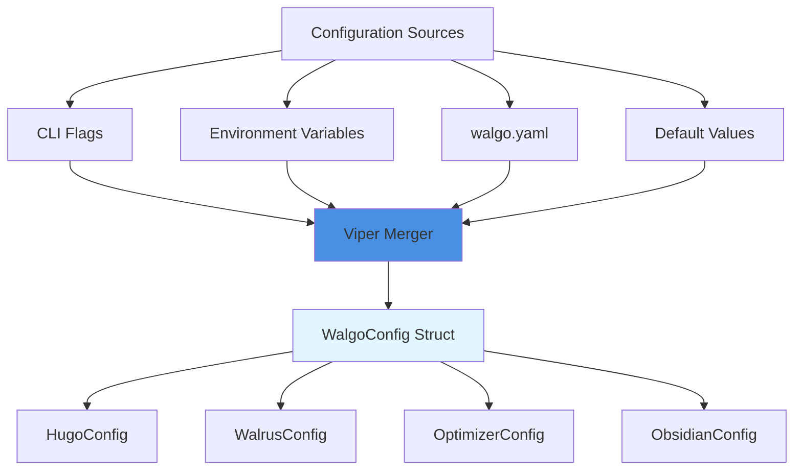

**Configuration Priority (highest to lowest):**
1. CLI flags (`--epochs 5`)
2. Environment variables (`WALGO_EPOCHS=5`)
3. Configuration file (`walgo.yaml`)
4. Default values

**Search Paths:**
1. `--config` flag path
2. Current directory (`./walgo.yaml`)
3. Home directory (`~/.walgo.yaml`)

### 7. Obsidian Integration (`internal/obsidian/`)

Import Obsidian vaults to Hugo:


**Conversion Process:**

1. **Scan Vault** - Find all `.md` files recursively
2. **Filter** - Optionally skip drafts (`draft: true`)
3. **Wikilink Conversion** - `[[Page]]` → `[Page](page.md)`
4. **Frontmatter** - Convert YAML/TOML/JSON formats
5. **Attachments** - Copy images, PDFs to Hugo static directory
6. **Organization** - Preserve directory structure

## Deployment Flow

### HTTP Deployment Flow

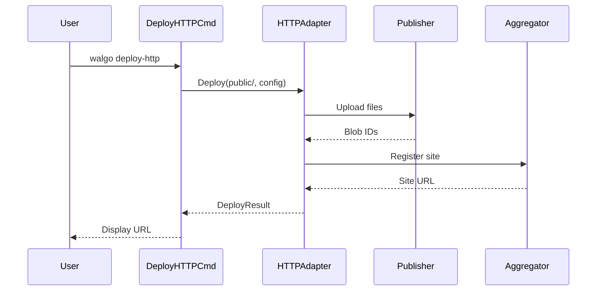

### On-Chain Deployment Flow

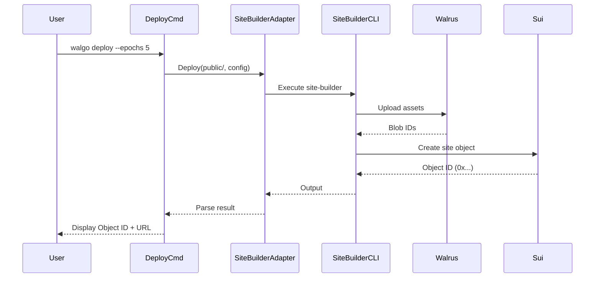

## Data Flow

### Build and Deploy Pipeline

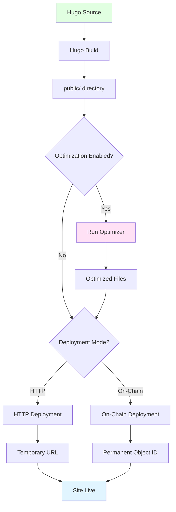

### Configuration Loading

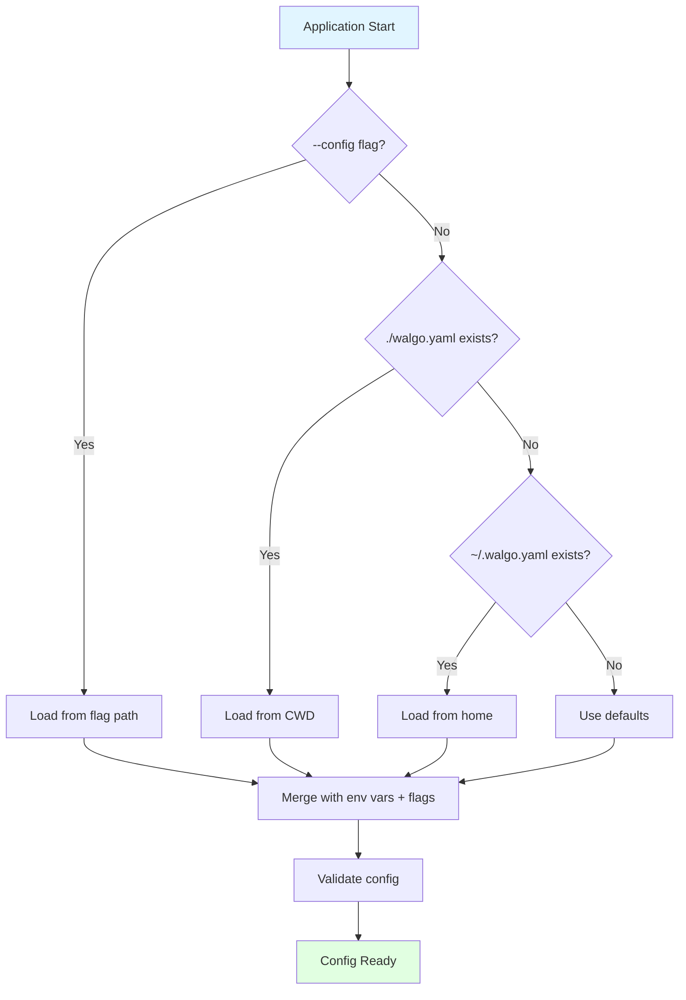

## Design Patterns

### 1. Command Pattern

Each CLI command is implemented as a separate Cobra command:

```go
// cmd/deploy.go
var deployCmd = &cobra.Command{
    Use:   "deploy",
    Short: "Deploy site to Walrus (on-chain)",
    RunE:  runDeploy,
}

func runDeploy(cmd *cobra.Command, args []string) error {
    // Command implementation
}
```

### 2. Adapter Pattern

Different deployment backends implement the same interface:

```go
// internal/deployer/deployer.go
type WalrusDeployer interface {
    Deploy(directory string, config DeployConfig) (*DeployResult, error)
    ValidateDependencies() error
}

// Implementations:
// - internal/deployer/http/adapter.go
// - internal/deployer/sitebuilder/adapter.go
```

### 3. Dependency Injection

External commands are mockable for testing:

```go
// internal/walrus/walrus.go
var (
    execCommand  = exec.Command      // Can be mocked
    execLookPath = exec.LookPath     // Can be mocked
)

// In tests:
execCommand = func(name string, args ...string) *exec.Cmd {
    return mockCommand()
}
```

### 4. Configuration as Code

Viper manages multi-format configuration:

```go
// internal/config/config.go
func LoadConfig(path string) (*WalgoConfig, error) {
    viper.SetConfigName("walgo")
    viper.SetConfigType("yaml")
    viper.AddConfigPath(".")
    viper.AddConfigPath("$HOME")
    // ...
}
```

### 5. Pipeline Pattern

Optimizer processes files through multiple stages:

```go
// internal/optimizer/optimizer.go
func (o *Optimizer) OptimizeDirectory(dir string) (*Stats, error) {
    files := o.discoverFiles(dir)
    filtered := o.applySkipPatterns(files)
    optimized := o.optimizeFiles(filtered)
    return o.calculateStats(optimized), nil
}
```

## Package Structure

```
walgo/
├── main.go                      # Entry point
├── cmd/                         # CLI commands
│   ├── root.go                 # Root command + global flags
│   ├── init.go                 # Hugo site initialization
│   ├── build.go                # Build Hugo site + optimize
│   ├── deploy.go               # On-chain deployment
│   ├── deploy_http.go          # HTTP deployment
│   ├── update.go               # Update existing site
│   ├── status.go               # Check deployment status
│   ├── doctor.go               # Diagnostics
│   ├── optimize.go             # Manual optimization
│   ├── import.go               # Obsidian import
│   └── setup.go                # Wallet setup
│
├── internal/                    # Internal packages (not exported)
│   ├── config/                 # Configuration management
│   │   ├── config.go           # Load/save config
│   │   └── types.go            # Config structs
│   │
│   ├── hugo/                   # Hugo integration
│   │   └── hugo.go             # Hugo CLI wrapper
│   │
│   ├── optimizer/              # Asset optimization
│   │   ├── optimizer.go        # Main engine
│   │   ├── html.go             # HTML optimization
│   │   ├── css.go              # CSS optimization
│   │   ├── js.go               # JS optimization
│   │   └── types.go            # Config types
│   │
│   ├── walrus/                 # Walrus integration
│   │   └── walrus.go           # site-builder wrapper
│   │
│   ├── deployer/               # Deployment abstraction
│   │   ├── deployer.go         # Interface definition
│   │   ├── http/               # HTTP adapter
│   │   │   └── adapter.go
│   │   └── sitebuilder/        # On-chain adapter
│   │       └── adapter.go
│   │
│   └── obsidian/               # Obsidian integration
│       └── obsidian.go         # Vault import
│
└── docs/                        # Documentation
    ├── ARCHITECTURE.md          # This file
    ├── CONTRIBUTING.md          # Contribution guide
    ├── OPTIMIZER.md             # Optimizer docs
    └── [additional docs]
```

## Technology Stack

| Layer | Technology | Purpose |
|-------|-----------|---------|
| **CLI Framework** | Cobra | Command structure, flags, help |
| **Configuration** | Viper | Multi-format config, env vars |
| **Build Tool** | Hugo (external) | Static site generation |
| **Deployment** | site-builder (external) | On-chain deployment to Walrus |
| **Blockchain** | Sui (external) | Wallet management, transactions |
| **Storage** | Walrus | Decentralized blob storage |
| **Testing** | Go testing + race detector | Unit + integration tests |
| **CI/CD** | GitHub Actions | Automated testing, builds, releases |

## Key Design Decisions

### 1. External Tool Wrappers

**Decision:** Wrap external CLIs (Hugo, site-builder, sui) rather than importing libraries.

**Rationale:**
- Official tools are well-maintained and tested
- Avoids version conflicts and dependency hell
- Simpler error handling and debugging
- Users already have these tools installed

### 2. Dual Deployment Modes

**Decision:** Support both HTTP and on-chain deployment.

**Rationale:**
- HTTP mode lowers barrier to entry (no wallet needed)
- On-chain provides permanence for production sites
- Users can test HTTP, then upgrade to on-chain
- Flexibility for different use cases

### 3. Built-in Optimization

**Decision:** Include asset optimizer rather than relying on Hugo's minification.

**Rationale:**
- More aggressive optimization (unused CSS removal)
- Works with any Hugo theme
- Consistent optimization across all sites
- User control over optimization levels

### 4. Configuration File

**Decision:** Use `walgo.yaml` instead of extending Hugo's config.

**Rationale:**
- Clear separation of concerns (Hugo vs Walgo settings)
- Doesn't pollute Hugo configuration
- Easier to version and share Walgo-specific settings
- Supports multiple Hugo sites with same Walgo config

### 5. Package Organization

**Decision:** Use `internal/` for all implementation packages.

**Rationale:**
- Prevents external projects from importing internal APIs
- Allows refactoring without breaking compatibility
- Clear signal that no public API is provided
- Encourages use as CLI tool, not library

## Performance Considerations

### 1. Optimization Pipeline

- **Parallel Processing:** Files can be optimized concurrently
- **Skip Patterns:** Avoid re-processing `.min.*` files
- **Incremental:** Only optimize changed files (future enhancement)

### 2. Deployment

- **Chunked Upload:** Large files split into chunks
- **Compression:** Assets compressed before upload
- **Caching:** Unchanged blobs reused in updates

### 3. Memory Usage

- **Streaming:** Large files processed in streams
- **Cleanup:** Temporary files removed after deployment
- **Bounded:** Memory usage doesn't grow with site size

## Security Considerations

### 1. Wallet Management

- **No Storage:** Walgo doesn't store private keys
- **External Wallet:** Uses Sui CLI for signing
- **Prompts:** User approves each transaction

### 2. Configuration

- **Validation:** All config values validated
- **Sanitization:** User input sanitized before exec
- **Permissions:** Config files checked for proper permissions

### 3. Dependencies

- **Minimal:** Only essential dependencies included
- **Vetted:** All dependencies security-scanned
- **Updates:** Regular dependency updates via CI

## Future Enhancements

### Planned Features

1. **Incremental Optimization** - Only optimize changed files
2. **Source Maps** - Generate source maps for debugging
3. **CDN Integration** - Integrate with CDN for faster delivery
4. **Multi-site Management** - Manage multiple sites from one config
5. **Analytics** - Built-in analytics for site traffic
6. **Custom Domains** - IPNS/DNS integration for custom domains

### Architecture Improvements

1. **Plugin System** - Allow third-party optimizer plugins
2. **Watch Mode** - Auto-rebuild on file changes
3. **Progressive Upload** - Resume interrupted uploads
4. **Differential Updates** - Only upload changed files
5. **Batch Operations** - Deploy multiple sites at once

---

For more information, see:
- [Development Guide](DEVELOPMENT.md)
- [Contributing Guide](CONTRIBUTING.md)
- [Optimizer Documentation](OPTIMIZER.md)
