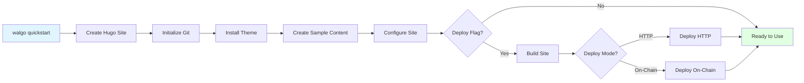
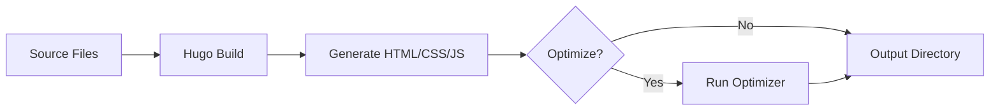

# Commands Reference

Complete reference for all Walgo commands and their options.

## Table of Contents

- [Global Flags](#global-flags)
- [Site Management](#site-management)
- [Deployment Commands](#deployment-commands)
- [Content Commands](#content-commands)
- [Utility Commands](#utility-commands)
- [Command Examples](#command-examples)

## Global Flags

These flags work with all commands:

### `--config`

Specify configuration file location.

```bash
walgo <command> --config /path/to/config.yaml
```

**Default:** Searches `./walgo.yaml`, then `~/.walgo.yaml`

### `--verbose` / `-v`

Enable verbose output.

```bash
walgo <command> --verbose
walgo <command> -v
```

**Use when:** Debugging issues or wanting detailed logs.

### `--help` / `-h`

Show help for a command.

```bash
walgo --help
walgo <command> --help
```

## Quick Start

### `walgo quickstart`

The fastest way to get started with Walgo. Creates a new site, adds a theme, creates sample content, and optionally deploys it - all in one command.

#### Syntax

```bash
walgo quickstart <name> [flags]
```

#### Arguments

- `<name>` - Name of the site directory

#### Flags

- `--theme <theme>` - Hugo theme to install (default: `PaperMod`)
- `--deploy` - Deploy immediately after setup
- `--deploy-mode <mode>` - Deployment mode: `http` or `onchain` (default: `http`)
- `--epochs <number>` - Storage epochs for on-chain deployment (default: `5`)
- `--skip-content` - Skip creating sample content
- `--skip-build` - Skip building the site

#### Examples

```bash
# Quickstart with defaults (HTTP deployment)
walgo quickstart my-blog

# Quickstart with custom theme
walgo quickstart my-blog --theme hugo-theme-stack

# Quickstart with on-chain deployment
walgo quickstart my-blog --deploy --deploy-mode onchain --epochs 10

# Quickstart without deployment
walgo quickstart my-blog --deploy=false

# Quickstart with minimal setup (no sample content)
walgo quickstart my-blog --skip-content
```

#### What It Does

The quickstart command automates the entire setup process:



**Step-by-step process:**

1. **Creates Hugo site** - `walgo init <name>`
2. **Initializes Git** - `git init`
3. **Installs theme** - Downloads and configures theme
4. **Creates sample content** - Adds example posts
5. **Configures site** - Sets up `hugo.toml` and `walgo.yaml`
6. **Builds site** (if deploying) - `walgo build`
7. **Deploys** (if `--deploy` flag) - `walgo deploy-http` or `walgo deploy`

#### Output Example

```
🚀 Walgo Quickstart
==================

Creating new Hugo site 'my-blog'...
✓ Site structure created

Initializing Git repository...
✓ Git initialized

Installing theme 'PaperMod'...
✓ Theme installed as submodule
✓ Theme configured in hugo.toml

Creating sample content...
✓ Created posts/welcome.md
✓ Created posts/getting-started.md
✓ Created about.md

Configuring site...
✓ hugo.toml updated
✓ walgo.yaml created

Building site...
✓ Hugo build completed (42 files)
✓ Assets optimized (saved 234 KB)

Deploying to Walrus (HTTP mode)...
✓ Files uploaded
✓ Site published

🎉 Your site is ready!

📁 Site directory: ./my-blog
🌐 URL: https://5tphzvq5shsxzugrz7kqd5bhnbajqfamvtxrn8jbfm3jbibzz1.walrus.site

Next steps:
  cd my-blog
  walgo serve              # Preview locally
  hugo new posts/my-post.md # Create new content

Learn more: https://github.com/selimozten/walgo/tree/main/docs
```

#### Sample Content Created

The quickstart command creates the following sample content:

**posts/welcome.md:**
```markdown
---
title: "Welcome to Your New Site"
date: 2025-01-23T10:00:00Z
draft: false
tags: ["welcome", "getting-started"]
---

Welcome to your new decentralized website powered by Walgo and Walrus!

This is a sample post to get you started. You can edit or delete it.
```

**posts/getting-started.md:**
```markdown
---
title: "Getting Started with Walgo"
date: 2025-01-23T10:30:00Z
draft: false
tags: ["tutorial", "walgo"]
---

Learn how to use Walgo to deploy your Hugo sites to Walrus...
```

**about.md:**
```markdown
---
title: "About"
date: 2025-01-23T10:00:00Z
---

This is your about page. Tell your visitors about yourself!
```

#### When to Use Quickstart

**Perfect for:**
- First-time users
- Quick prototypes
- Learning Walgo
- Demo sites
- Blog starters

**Not ideal for:**
- Existing Hugo sites (use `walgo build` + `walgo deploy` instead)
- Custom theme requirements (install theme manually)
- Complex configurations (configure manually)

#### Comparison with Manual Setup

| Task | Quickstart | Manual Setup |
|------|-----------|--------------|
| Create site | ✓ Automatic | `walgo init` |
| Add theme | ✓ Automatic | Git submodule |
| Sample content | ✓ Automatic | `hugo new` × 3 |
| Configuration | ✓ Automatic | Edit configs |
| Build | ✓ Automatic | `walgo build` |
| Deploy | ✓ Optional | `walgo deploy-http` |
| **Time** | **~2 minutes** | **~10 minutes** |

---

## Site Management

### `walgo init`

Create a new Hugo site.

#### Syntax

```bash
walgo init <name> [flags]
```

#### Arguments

- `<name>` - Name of the site directory

#### Flags

- `--force` - Overwrite existing directory
- `--format <format>` - Config format: `toml`, `yaml`, or `json` (default: `toml`)

#### Examples

```bash
# Create new site
walgo init my-site

# Create with YAML config
walgo init my-site --format yaml

# Overwrite existing directory
walgo init my-site --force
```

#### What It Does

1. Creates directory structure
2. Initializes Hugo configuration
3. Creates default archetypes
4. Sets up content directories

#### Output Structure

```
my-site/
├── archetypes/
│   └── default.md
├── content/
├── data/
├── layouts/
├── static/
├── themes/
└── hugo.toml
```

---

### `walgo build`

Build Hugo site with optional optimization.

#### Syntax

```bash
walgo build [flags]
```

#### Flags

- `--no-optimize` - Skip asset optimization
- `--draft` - Include draft content
- `--source <dir>` - Source directory (default: current directory)
- `--destination <dir>` - Output directory (default: `public`)
- `--base-url <url>` - Override baseURL
- `--minify` - Enable Hugo's built-in minification

#### Examples

```bash
# Standard build
walgo build

# Build without optimization
walgo build --no-optimize

# Build with drafts
walgo build --draft

# Custom output directory
walgo build --destination dist

# Override baseURL
walgo build --base-url https://example.walrus.site/
```

#### Build Process



#### Output

```
Building Hugo site...
✓ Hugo build completed (234 files generated)

Optimizing assets...
🎯 Optimization Results
======================
Files processed: 234
Files optimized: 89
Bytes saved: 1.2 MB (34.5%)
Duration: 456ms

✓ Build completed successfully!
```

---

### `walgo serve`

Start local development server.

#### Syntax

```bash
walgo serve [flags]
```

#### Flags

- `--port <port>` - Port to serve on (default: `1313`)
- `--bind <address>` - Interface to bind to (default: `127.0.0.1`)
- `--draft` - Include draft content
- `--no-live-reload` - Disable live reload
- `--navigate-to-changed` - Navigate to changed file

#### Examples

```bash
# Start server on default port
walgo serve

# Custom port
walgo serve --port 8080

# Include drafts
walgo serve --draft

# Bind to all interfaces (access from network)
walgo serve --bind 0.0.0.0
```

#### Output

```
Starting Hugo development server...
✓ Server running at http://localhost:1313/

Press Ctrl+C to stop
```

---

## Deployment Commands

### `walgo deploy`

Deploy site to Walrus (on-chain mode).

#### Syntax

```bash
walgo deploy [flags]
```

#### Flags

- `--epochs <number>` - Storage duration in epochs (default: `5`)
- `--network <network>` - Network: `testnet` or `mainnet` (default: `testnet`)
- `--gas-budget <amount>` - Maximum gas to spend (default: auto)
- `--wallet <path>` - Wallet configuration path
- `--directory <dir>` - Directory to deploy (default: `public`)

#### Examples

```bash
# Deploy with default settings
walgo deploy

# Deploy with 10 epochs (~10 months)
walgo deploy --epochs 10

# Deploy to mainnet
walgo deploy --network mainnet

# Deploy custom directory
walgo deploy --directory dist

# Set gas budget
walgo deploy --gas-budget 100000000
```

#### Prerequisites

- Sui wallet configured (`walgo setup`)
- Sufficient SUI tokens for gas + storage
- site-builder CLI installed

#### Output

```
Deploying to Walrus (on-chain)...
✓ Assets uploaded to Walrus
✓ Site object created on Sui
✓ Deployment successful

🌐 Your site is live!
Object ID: 0x7b5a...8f3c
URL: https://5tphzvq5shsxzugrz7kqd5bhnbajqfamvtxrn8jbfm3jbibzz1.walrus.site

📊 Deployment Stats:
Files: 234
Total size: 2.4 MB
Epochs: 5
Cost: 0.15 SUI
Transaction: 0xabc...def
```

---

### `walgo deploy-http`

Deploy site via HTTP (no wallet required).

#### Syntax

```bash
walgo deploy-http [flags]
```

#### Flags

- `--directory <dir>` - Directory to deploy (default: `public`)
- `--publisher <url>` - Publisher URL (default: Walrus default)
- `--aggregator <url>` - Aggregator URL (default: Walrus default)

#### Examples

```bash
# Deploy with defaults
walgo deploy-http

# Deploy custom directory
walgo deploy-http --directory dist

# Custom publisher/aggregator
walgo deploy-http --publisher https://publisher.walrus.site --aggregator https://aggregator.walrus.site
```

#### Output

```
Deploying to Walrus via HTTP...
✓ Files uploaded successfully
✓ Site published

🌐 Your site is live!
URL: https://5tphzvq5shsxzugrz7kqd5bhnbajqfamvtxrn8jbfm3jbibzz1.walrus.site

📊 Deployment Stats:
Files: 234
Total size: 2.4 MB
Upload time: 8.3s

⚠️  Note: HTTP deployments are temporary (~30 days)
```

#### Limitations

- **Temporary:** Expires after ~30 days
- **No updates:** Cannot update after deployment
- **No custom domains:** Cannot use SuiNS domains

---

### `walgo update`

Update existing on-chain deployment.

#### Syntax

```bash
walgo update <object-id> [flags]
```

#### Arguments

- `<object-id>` - Site object ID (from initial deployment)

#### Flags

- `--directory <dir>` - Directory to deploy (default: `public`)
- `--network <network>` - Network: `testnet` or `mainnet`
- `--gas-budget <amount>` - Maximum gas to spend

#### Examples

```bash
# Update existing site
walgo update 0x7b5a...8f3c

# Update with custom directory
walgo update 0x7b5a...8f3c --directory dist

# Update on mainnet
walgo update 0x7b5a...8f3c --network mainnet
```

#### Output

```
Updating site 0x7b5a...8f3c...
✓ Changes detected in 12 files
✓ Assets uploaded to Walrus
✓ Site object updated

🌐 Site updated successfully!
URL: https://5tphzvq5shsxzugrz7kqd5bhnbajqfamvtxrn8jbfm3jbibzz1.walrus.site

📊 Update Stats:
Files changed: 12
Files added: 3
Files removed: 1
Cost: 0.03 SUI
Transaction: 0xdef...abc
```

---

### `walgo status`

Check deployment status.

#### Syntax

```bash
walgo status <object-id> [flags]
```

#### Arguments

- `<object-id>` - Site object ID

#### Flags

- `--network <network>` - Network: `testnet` or `mainnet`
- `--json` - Output in JSON format

#### Examples

```bash
# Check site status
walgo status 0x7b5a...8f3c

# Check mainnet site
walgo status 0x7b5a...8f3c --network mainnet

# JSON output
walgo status 0x7b5a...8f3c --json
```

#### Output

```
Site Status: 0x7b5a...8f3c
========================

Status: Active
URL: https://5tphzvq5shsxzugrz7kqd5bhnbajqfamvtxrn8jbfm3jbibzz1.walrus.site
Network: testnet

📊 Site Info:
Total files: 234
Total size: 2.4 MB
Entry point: index.html
SuiNS domain: myblog.sui

⏱️  Storage Info:
Created: 2025-01-15 10:30:00
Epochs: 5 (remaining: 3)
Expires: 2025-06-15 (approximately)

💰 Cost Info:
Initial cost: 0.15 SUI
Updates: 2
Total spent: 0.21 SUI
```

---

## Content Commands

### `walgo import-obsidian`

Import Obsidian vault to Hugo.

#### Syntax

```bash
walgo import-obsidian [flags]
```

#### Flags

- `--vault <path>` - Obsidian vault path (required)
- `--content-dir <dir>` - Hugo content directory (default: `content`)
- `--attachment-dir <dir>` - Attachment output directory (default: `static/images`)
- `--convert-wikilinks` - Convert `[[links]]` to markdown (default: `true`)
- `--include-drafts` - Include draft notes (default: `false`)
- `--frontmatter-format <format>` - Format: `yaml`, `toml`, or `json` (default: `yaml`)

#### Examples

```bash
# Import vault
walgo import-obsidian --vault ~/Documents/MyVault

# Import with custom directories
walgo import-obsidian --vault ~/Documents/MyVault --content-dir posts --attachment-dir static/attachments

# Include drafts
walgo import-obsidian --vault ~/Documents/MyVault --include-drafts

# Use TOML frontmatter
walgo import-obsidian --vault ~/Documents/MyVault --frontmatter-format toml
```

#### Output

```
Importing Obsidian vault...
✓ Scanned vault: 156 notes found
✓ Filtered drafts: 142 notes to import
✓ Converted wikilinks: 487 links converted
✓ Copied attachments: 89 files

📊 Import Summary:
Notes imported: 142
Attachments: 89
Wikilinks converted: 487
Total size: 45 MB

✓ Import completed successfully!
```

---

### `walgo optimize`

Manually optimize assets.

#### Syntax

```bash
walgo optimize [directory] [flags]
```

#### Arguments

- `[directory]` - Directory to optimize (default: `public`)

#### Flags

- `--html` - Enable HTML optimization (default: `true`)
- `--css` - Enable CSS optimization (default: `true`)
- `--js` - Enable JavaScript optimization (default: `true`)
- `--remove-unused-css` - Remove unused CSS rules (aggressive)
- `--verbose` / `-v` - Show detailed output

#### Examples

```bash
# Optimize public directory
walgo optimize

# Optimize custom directory
walgo optimize dist

# Optimize only HTML
walgo optimize --css=false --js=false

# Aggressive CSS optimization
walgo optimize --remove-unused-css

# Verbose output
walgo optimize --verbose
```

#### Output

```
Optimizing assets in public/...

🎯 Optimization Results
======================
Files processed: 234
Files optimized: 89
Files skipped: 145
Duration: 456ms

📊 Size Reduction:
Original size: 2.4 MB
Optimized size: 1.8 MB
Bytes saved: 645.2 KB (26.9%)

📄 HTML Files:
Files: 42, Saved: 45.3 KB (18.2%)

🎨 CSS Files:
Files: 12, Saved: 234.7 KB (31.4%)

📜 JavaScript Files:
Files: 35, Saved: 365.2 KB (42.1%)

✓ Optimization completed successfully!
```

---

## Utility Commands

### `walgo setup`

Configure Sui wallet for on-chain deployments.

#### Syntax

```bash
walgo setup [flags]
```

#### Flags

- `--network <network>` - Network: `testnet` or `mainnet` (default: `testnet`)
- `--wallet-path <path>` - Custom wallet path
- `--key-scheme <scheme>` - Key scheme: `ed25519`, `secp256k1` (default: `ed25519`)

#### Examples

```bash
# Setup for testnet
walgo setup --network testnet

# Setup for mainnet
walgo setup --network mainnet

# Custom wallet path
walgo setup --wallet-path ~/.sui/custom-wallet
```

#### Interactive Setup

```
Setting up Sui wallet...

1. Generating new wallet...
✓ Wallet created

2. Recovery phrase (SAVE THIS SECURELY):
   word1 word2 word3 ... word12

3. Wallet address: 0xabc...def

4. Network: testnet

Setup complete!

Next steps:
1. Save your recovery phrase in a secure location
2. Get testnet SUI from faucet: https://discord.com/channels/916379725201563759/971488439931392130
3. Run 'walgo deploy' to deploy your site
```

---

### `walgo setup-deps`

Install required dependencies.

#### Syntax

```bash
walgo setup-deps [flags]
```

#### Flags

- `--hugo` - Install Hugo
- `--site-builder` - Install Walrus site-builder
- `--sui` - Install Sui CLI
- `--all` - Install all dependencies (default)

#### Examples

```bash
# Install all dependencies
walgo setup-deps

# Install only site-builder
walgo setup-deps --site-builder

# Install Hugo and Sui
walgo setup-deps --hugo --sui
```

#### Output

```
Installing dependencies...

✓ Hugo: Already installed (v0.125.0)
✓ site-builder: Installed (v0.1.0)
✓ Sui CLI: Installed (v1.20.0)

All dependencies are ready!
```

---

### `walgo doctor`

Diagnose installation and configuration.

#### Syntax

```bash
walgo doctor [flags]
```

#### Flags

- `--verbose` / `-v` - Show detailed diagnostics
- `--fix` - Attempt to fix issues automatically

#### Examples

```bash
# Basic diagnostics
walgo doctor

# Verbose output
walgo doctor -v

# Auto-fix issues
walgo doctor --fix
```

#### Output

```
Checking Walgo Installation
===========================

✓ Walgo is installed correctly (v1.0.0)
✓ Hugo is installed (v0.125.0)
✓ site-builder is installed (v0.1.0)
✓ Sui CLI is installed (v1.20.0)

Checking Configuration
=====================

✓ Configuration file found: ./walgo.yaml
✓ Configuration is valid

Checking Wallet
===============

✓ Wallet configured for testnet
✓ Wallet address: 0xabc...def
✓ Balance: 5.0 SUI

Checking Network
================

✓ Can reach Walrus publisher
✓ Can reach Walrus aggregator
✓ Can reach Sui RPC

All checks passed! ✅
```

---

### `walgo domain`

Manage SuiNS domains.

#### Syntax

```bash
walgo domain <subcommand> [flags]
```

#### Subcommands

- `list` - List owned domains
- `link <domain> <object-id>` - Link domain to site
- `unlink <domain>` - Unlink domain from site
- `info <domain>` - Show domain information

#### Examples

```bash
# List domains
walgo domain list

# Link domain to site
walgo domain link myblog.sui 0x7b5a...8f3c

# Unlink domain
walgo domain unlink myblog.sui

# Show domain info
walgo domain info myblog.sui
```

---

### `walgo convert`

Convert between object ID formats.

#### Syntax

```bash
walgo convert <object-id> [flags]
```

#### Flags

- `--format <format>` - Output format: `hex`, `base64`, `decimal`

#### Examples

```bash
# Convert to different formats
walgo convert 0x7b5a...8f3c

# Specific format
walgo convert 0x7b5a...8f3c --format base64
```

---

### `walgo version`

Show version information.

#### Syntax

```bash
walgo version
```

#### Output

```
Walgo version 1.0.0
Built with Go 1.24.0
Commit: abc123
Build date: 2025-01-15
```

---

## Command Examples

### Complete Workflow

```bash
# 1. Create new site
walgo init my-blog
cd my-blog

# 2. Add theme
git init
git submodule add https://github.com/adityatelange/hugo-PaperMod.git themes/PaperMod
echo 'theme = "PaperMod"' >> hugo.toml

# 3. Create content
hugo new posts/hello-world.md

# 4. Preview locally
walgo serve

# 5. Build site
walgo build

# 6. Deploy (HTTP for testing)
walgo deploy-http

# 7. Setup wallet for production
walgo setup --network testnet

# 8. Deploy on-chain
walgo deploy --epochs 5

# 9. Update site later
# ... make changes ...
walgo build
walgo update 0x7b5a...8f3c
```

### Obsidian to Blog Workflow

```bash
# 1. Create Hugo site
walgo init my-knowledge-base
cd my-knowledge-base

# 2. Import Obsidian vault
walgo import-obsidian --vault ~/Documents/MyVault

# 3. Build and deploy
walgo build
walgo deploy-http
```

### Multi-Environment Deployment

```bash
# Development
walgo build --config walgo.dev.yaml
walgo deploy-http

# Staging
walgo build --config walgo.staging.yaml
walgo deploy --epochs 1

# Production
walgo build --config walgo.prod.yaml
walgo deploy --epochs 10 --network mainnet
```

### Optimization Testing

```bash
# Build without optimization
walgo build --no-optimize

# Test optimization levels
walgo optimize --verbose

# Compare sizes
ls -lh public/

# Deploy optimized version
walgo deploy-http
```

## Related Documentation

- [Configuration Reference](CONFIGURATION.md) - All configuration options
- [Deployment Guide](DEPLOYMENT.md) - Detailed deployment strategies
- [Optimizer Documentation](OPTIMIZER.md) - Optimization details
- [Troubleshooting Guide](TROUBLESHOOTING.md) - Common issues

## Getting Help

For any command, use `--help`:

```bash
walgo --help
walgo init --help
walgo deploy --help
```
