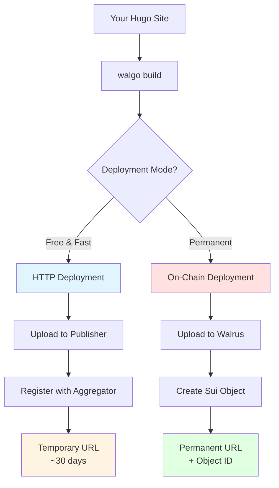
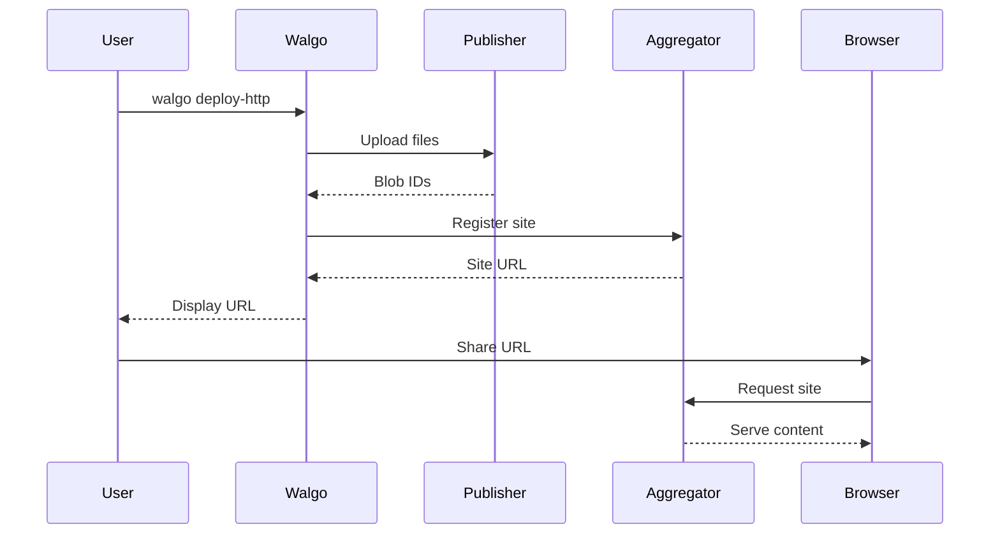
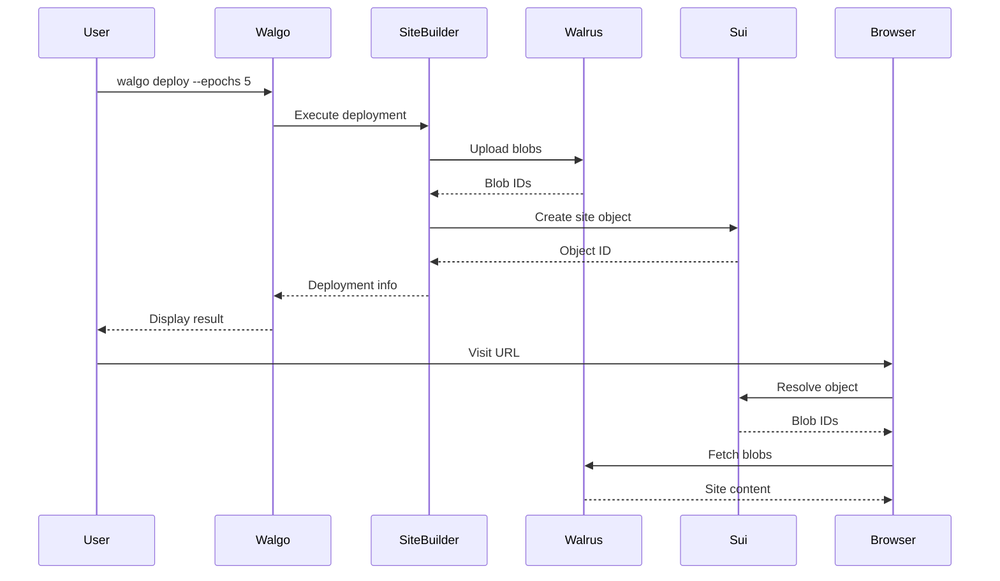
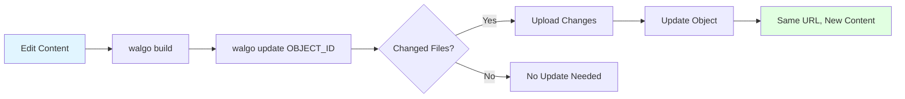

# Deployment Guide

Complete guide for deploying sites to Walrus using Walgo.

## Table of Contents

- [Deployment Overview](#deployment-overview)
- [HTTP Deployment](#http-deployment)
- [On-Chain Deployment](#on-chain-deployment)
- [Updating Deployments](#updating-deployments)
- [Custom Domains](#custom-domains)
- [Best Practices](#best-practices)
- [Cost Optimization](#cost-optimization)

## Deployment Overview

Walgo supports two deployment modes:



### Comparison

| Feature | HTTP Mode | On-Chain Mode |
|---------|-----------|---------------|
| **Cost** | Free | Requires SUI tokens |
| **Setup** | None | Wallet configuration |
| **Speed** | Fast (5-15s) | Moderate (30-60s) |
| **Permanence** | ~30 days | Epochs (configurable) |
| **Updates** | Re-deploy only | Update in place |
| **Custom Domain** | No | Yes (via SuiNS) |
| **Object ID** | No | Yes |
| **Best For** | Testing, previews | Production sites |

## HTTP Deployment

Perfect for testing and temporary sites.

### Prerequisites

- Hugo installed
- Site built with `walgo build`
- Internet connection

**No wallet or cryptocurrency required!**

### Basic HTTP Deployment

```bash
# Build your site
walgo build

# Deploy via HTTP
walgo deploy-http
```

### Output Example

```
Deploying to Walrus via HTTP...

📤 Uploading files to publisher...
✓ index.html (4.2 KB)
✓ style.css (12.8 KB)
✓ script.js (8.4 KB)
... 234 files total ...

✓ Files uploaded successfully

📡 Registering with aggregator...
✓ Site published

🌐 Your site is live!
URL: https://5tphzvq5shsxzugrz7kqd5bhnbajqfamvtxrn8jbfm3jbibzz1.walrus.site

📊 Deployment Stats:
Files: 234
Total size: 2.4 MB
Upload time: 8.3s

⚠️  Note: HTTP deployments expire after ~30 days
```

### Custom Publisher/Aggregator

```bash
# Use custom endpoints
walgo deploy-http \
  --publisher https://custom-publisher.walrus.site \
  --aggregator https://custom-aggregator.walrus.site
```

### HTTP Deployment Workflow



### Limitations

1. **Temporary** - Expires after ~30 days
2. **No updates** - Must re-deploy (gets new URL)
3. **No custom domains** - Can't use SuiNS
4. **No ownership** - Can't prove site ownership

### When to Use HTTP Mode

- **Testing** - Try before on-chain deployment
- **Previews** - Share with stakeholders
- **Learning** - Practice without spending tokens
- **Temporary** - Short-lived content

## On-Chain Deployment

Permanent, updateable deployments on Sui blockchain.

### Prerequisites

1. **Sui Wallet** - Configured with `walgo setup`
2. **SUI Tokens** - For gas and storage fees
3. **site-builder** - Installed via `walgo setup-deps`
4. **Built Site** - Ready in `public/` directory

### First-Time Setup

#### Step 1: Install Dependencies

```bash
walgo setup-deps
```

This installs:
- Walrus site-builder
- Sui CLI

#### Step 2: Configure Wallet

```bash
# For testnet
walgo setup --network testnet

# For mainnet (use with caution!)
walgo setup --network mainnet
```

Follow the interactive prompts to:
1. Generate new wallet
2. Save recovery phrase (IMPORTANT!)
3. Note wallet address

#### Step 3: Get Testnet SUI

Visit the Sui Discord faucet:
```
https://discord.com/channels/916379725201563759/971488439931392130
```

Request format:
```
!faucet <your-wallet-address>
```

Wait for confirmation (~30 seconds).

#### Step 4: Verify Balance

```bash
walgo doctor
```

Check the "Wallet" section shows sufficient balance.

### Basic On-Chain Deployment

```bash
# Build your site
walgo build

# Deploy with default settings (5 epochs)
walgo deploy
```

### Advanced Deployment Options

#### Custom Epoch Count

```bash
# Deploy for 1 epoch (~30 days)
walgo deploy --epochs 1

# Deploy for 10 epochs (~10 months)
walgo deploy --epochs 10

# Deploy for 50 epochs (~4 years)
walgo deploy --epochs 50
```

**Cost increases with epochs!**

#### Custom Gas Budget

```bash
# Set maximum gas to spend
walgo deploy --gas-budget 100000000

# Let Walgo estimate (default)
walgo deploy
```

#### Deploy from Custom Directory

```bash
# Deploy from dist/ instead of public/
walgo deploy --directory dist
```

### Deployment Output

```
Deploying to Walrus (on-chain)...

📤 Uploading assets to Walrus...
✓ Processing 234 files...
✓ Uploading to storage nodes...
✓ Blob IDs received

📝 Creating site object on Sui...
✓ Transaction submitted
✓ Transaction confirmed

🌐 Your site is live!
Object ID: 0x7b5a8d3f2c1e9b4a6f5d8c2e1a3b7f9d4c6e8a1b5d7f3c9e2a8b4f6d1c5e7a3b
URL: https://5tphzvq5shsxzugrz7kqd5bhnbajqfamvtxrn8jbfm3jbibzz1.walrus.site

📊 Deployment Stats:
Files: 234
Total size: 2.4 MB
Epochs: 5
Upload time: 34.2s

💰 Cost Breakdown:
Storage cost: 0.12 SUI (5 epochs)
Gas fee: 0.03 SUI
Total: 0.15 SUI

📋 Transaction Details:
Transaction ID: 0xdef456...
Block: 12345678
Timestamp: 2025-01-15 14:30:00 UTC

⚠️  Important: Save your Object ID!
You'll need it to update or manage this site.
```

### Save Deployment Info

```bash
# Save object ID to config
echo "walrus:
  projectID: \"0x7b5a8d3f2c1e9b4a6f5d8c2e1a3b7f9d4c6e8a1b5d7f3c9e2a8b4f6d1c5e7a3b\"" >> walgo.yaml
```

### On-Chain Deployment Workflow



## Updating Deployments

Only available for on-chain deployments.

### Why Update Instead of Redeploy?

- **Same URL** - Users keep the same link
- **Lower Cost** - Only pay for changed files
- **Preserve Object ID** - Ownership remains
- **Custom Domains** - No need to re-link SuiNS

### Basic Update

```bash
# Make changes to your site
# ... edit content ...

# Rebuild
walgo build

# Update existing deployment
walgo update 0x7b5a...
```

### Update Output

```
Updating site 0x7b5a8d3f2c1e9b4a6f5d8c2e1a3b7f9d4c6e8a1b5d7f3c9e2a8b4f6d1c5e7a3b...

📊 Analyzing changes...
Files changed: 12
Files added: 3
Files removed: 1
Files unchanged: 218

📤 Uploading changes to Walrus...
✓ Uploading 15 files...
✓ Blob IDs received

📝 Updating site object on Sui...
✓ Transaction submitted
✓ Transaction confirmed

🌐 Site updated successfully!
URL: https://5tphzvq5shsxzugrz7kqd5bhnbajqfamvtxrn8jbfm3jbibzz1.walrus.site
(URL unchanged)

💰 Cost:
Storage cost: 0.02 SUI (changed files only)
Gas fee: 0.01 SUI
Total: 0.03 SUI

Transaction ID: 0xabc789...
```

### Update Workflow



### Checking Before Update

```bash
# Check current status
walgo status 0x7b5a...

# See what changed (Hugo's diff)
git diff
```

### Update Best Practices

1. **Test locally first** - Use `walgo serve`
2. **Build before update** - Always `walgo build` first
3. **Check status** - Verify site is active
4. **Save object ID** - Store in `walgo.yaml`
5. **Monitor costs** - Large updates cost more

## Custom Domains

Use SuiNS domains for human-readable URLs.

### Prerequisites

1. **Own a SuiNS domain** - Register at [suins.io](https://suins.io)
2. **On-chain deployment** - Have a site object ID
3. **Sui wallet** - Configured and funded

For detailed instructions, see the [SuiNS tutorial](https://docs.wal.app/docs/walrus-sites/tutorial-suins).

### Linking Domain to Site

```bash
# Link domain
walgo domain link myblog.sui 0x7b5a...

# Verify link
walgo domain info myblog.sui
```

### Output

```
Linking domain myblog.sui to site 0x7b5a...

✓ Domain ownership verified
✓ Link transaction submitted
✓ Link confirmed

🌐 Domain linked successfully!
Your site is now accessible at:
- https://myblog.sui.walrus.site
- https://5tphzvq5shsxzugrz7kqd5bhnbajqfamvtxrn8jbfm3jbibzz1.walrus.site

Both URLs point to the same site.
```

### Managing Domains

```bash
# List your domains
walgo domain list

# Unlink domain
walgo domain unlink myblog.sui

# Check domain info
walgo domain info myblog.sui
```

### Update Configuration

```yaml
# walgo.yaml
walrus:
  suinsDomain: "myblog.sui"
```

## Best Practices

### 1. Development Workflow

```bash
# Recommended flow
walgo build                    # Build locally
walgo serve                    # Test locally
walgo build --no-optimize      # Build without optimization (debug)
walgo deploy-http              # Test on Walrus HTTP
# ... verify everything works ...
walgo build                    # Build with optimization
walgo deploy --epochs 5        # Deploy on-chain
```

### 2. Version Control

```bash
# Track deployments in Git
echo "# Deployments
- Testnet: 0x7b5a...
- Mainnet: 0x9c8d...
" > DEPLOYMENTS.md

git add DEPLOYMENTS.md
git commit -m "Add deployment info"
```

### 3. Configuration Management

```yaml
# walgo.yaml - Track deployment info
walrus:
  projectID: "0x7b5a..."    # Save object ID
  epochs: 5                 # Document epoch choice
  network: "testnet"        # Clearly mark network
  suinsDomain: "myblog.sui" # Track custom domain
```

### 4. Multi-Environment Strategy

```bash
# Separate configs for each environment
walgo.dev.yaml     # Development (HTTP only)
walgo.staging.yaml # Staging (testnet, 1 epoch)
walgo.prod.yaml    # Production (mainnet, 50 epochs)

# Deploy to each
walgo build --config walgo.dev.yaml && walgo deploy-http
walgo build --config walgo.staging.yaml && walgo deploy --epochs 1
walgo build --config walgo.prod.yaml && walgo deploy --epochs 50 --network mainnet
```

### 5. Pre-Deployment Checklist

- [ ] Content reviewed and finalized
- [ ] Local preview tested (`walgo serve`)
- [ ] Optimization tested (`walgo build`)
- [ ] HTTP deployment tested (`walgo deploy-http`)
- [ ] Configuration file updated
- [ ] Sufficient SUI balance (`walgo doctor`)
- [ ] Correct network selected (testnet/mainnet)
- [ ] Epoch count decided

### 6. Post-Deployment Checklist

- [ ] Object ID saved in `walgo.yaml`
- [ ] URL tested in browser
- [ ] All pages/links working
- [ ] Images loading correctly
- [ ] Custom domain linked (if applicable)
- [ ] Deployment documented
- [ ] Git commit created

## Cost Optimization

### Understanding Costs

On-chain deployments have two costs:

1. **Storage Cost** - Based on data size and epochs
2. **Gas Fee** - Transaction fee (fixed per deployment)

```
Total Cost = (File Size × Epochs × Storage Rate) + Gas Fee
```

### Reducing Storage Costs

#### 1. Optimize Assets

```bash
# Enable aggressive optimization
walgo build
```

Typical savings:
- HTML: 15-25%
- CSS: 20-40%
- JavaScript: 25-50%
- **Total: 20-35% smaller**

#### 2. Compress Images

Before deployment:

```bash
# Use ImageOptim, TinyPNG, or similar tools
# Or Hugo's image processing:
# https://gohugo.io/content-management/image-processing/
```

Image optimization can save 50-80% on image files.

#### 3. Remove Unused Files

```bash
# Remove source maps
find public -name "*.map" -delete

# Remove unused themes
rm -rf public/themes/unused-theme/
```

#### 4. Choose Appropriate Epochs

| Duration | Epochs | Use Case |
|----------|--------|----------|
| 1 month | 1 | Testing, short-term |
| 3 months | 3 | Seasonal content |
| 6 months | 6 | Medium-term projects |
| 1 year | 12 | Annual content |
| 2 years | 24 | Long-term blogs |
| 5+ years | 50+ | Permanent archives |

**Don't over-provision!** You can always update/extend.

### Reducing Update Costs

#### 1. Batch Changes

```bash
# Bad - Multiple small updates
walgo update 0x7b5a...  # Update 1
# ... make more changes ...
walgo update 0x7b5a...  # Update 2
# ... more changes ...
walgo update 0x7b5a...  # Update 3

# Good - Batch changes
# ... make all changes ...
walgo build
walgo update 0x7b5a...  # Single update
```

#### 2. Test Before Update

```bash
# Test with HTTP first (free)
walgo build
walgo deploy-http
# ... verify changes ...
# Then update on-chain
walgo update 0x7b5a...
```

### Cost Estimates

Example site (2.4 MB, optimized):

| Epochs | Duration | Storage Cost | Gas Fee | Total |
|--------|----------|--------------|---------|-------|
| 1 | ~30 days | 0.024 SUI | 0.03 SUI | 0.054 SUI |
| 5 | ~5 months | 0.120 SUI | 0.03 SUI | 0.150 SUI |
| 10 | ~10 months | 0.240 SUI | 0.03 SUI | 0.270 SUI |
| 50 | ~4 years | 1.200 SUI | 0.03 SUI | 1.230 SUI |

**Note:** Rates are approximate and may change.

## Troubleshooting

### "Insufficient funds" Error

```bash
# Check balance
walgo doctor

# Get testnet SUI
# Visit Discord faucet (see setup section)

# Or reduce epochs
walgo deploy --epochs 1
```

### Deployment Timeout

```bash
# Increase timeout (if supported)
walgo deploy --timeout 300

# Or split into smaller deployments
# (deploy subdirectories separately)
```

### "site-builder not found"

```bash
# Install dependencies
walgo setup-deps --site-builder
```

### Update Fails with "Object not found"

```bash
# Verify object ID
walgo status 0x7b5a...

# Check network
walgo status 0x7b5a... --network testnet

# Ensure you're on correct network
walgo update 0x7b5a... --network testnet
```

### Site Not Loading

1. **Wait a moment** - Propagation takes 10-30 seconds
2. **Check status** - `walgo status 0x7b5a...`
3. **Try direct URL** - Use blob ID URL, not custom domain
4. **Clear browser cache** - Force reload (Ctrl+F5)

## Related Documentation

- [Getting Started Guide](GETTING_STARTED.md) - Your first deployment
- [Configuration Reference](CONFIGURATION.md) - All deployment options
- [Commands Reference](COMMANDS.md) - Command details
- [Troubleshooting Guide](TROUBLESHOOTING.md) - Common issues

## Additional Resources

- **Walrus Documentation:** [https://docs.walrus.site](https://docs.walrus.site)
- **Sui Documentation:** [https://docs.sui.io](https://docs.sui.io)
- **SuiNS:** [https://suins.io](https://suins.io)
- **Discord Faucet:** [Sui Discord](https://discord.com/channels/916379725201563759/971488439931392130)
