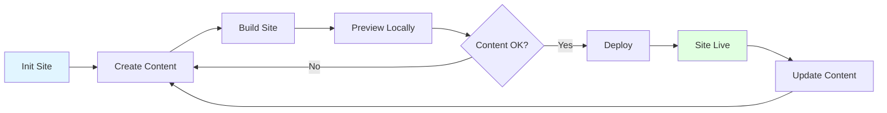

# Getting Started with Walgo

This guide will help you create and deploy your first site to Walrus using Walgo.

## Table of Contents

- [Prerequisites](#prerequisites)
- [Your First Site](#your-first-site)
- [Understanding the Workflow](#understanding-the-workflow)
- [Deployment Options](#deployment-options)
- [Next Steps](#next-steps)

## Prerequisites

Before you begin, make sure you have:

1. **Walgo installed** - See [Installation Guide](INSTALLATION.md)
2. **Hugo installed** - Required for all modes
3. **Basic command line knowledge** - Comfort with terminal/command prompt

**Optional (for on-chain deployment):**
- site-builder CLI
- Sui wallet with testnet SUI tokens

## Your First Site

### Quick Option: Use Quickstart (Recommended for Beginners)

The fastest way to get started is with the quickstart command:

```bash
# One command to create, configure, and deploy!
walgo quickstart my-first-site
```

This single command will:
1. Create a new Hugo site
2. Install the PaperMod theme
3. Add sample content (welcome post, about page)
4. Configure the site
5. Build with optimization
6. Deploy to Walrus (HTTP mode)

**Result:** Your site is live in ~2 minutes! 🎉

Skip to [Step 7](#step-7-share-your-site) to see your live site.

### Manual Option: Step-by-Step Setup

If you prefer to understand each step or customize the setup, follow these steps:

#### Step 1: Create a New Site

```bash
# Create a new Hugo site
walgo init my-first-site

# Navigate to the site directory
cd my-first-site
```

This creates a new directory structure:

```
my-first-site/
├── archetypes/       # Content templates
├── content/          # Your content (markdown files)
├── data/            # Data files
├── layouts/         # HTML templates
├── static/          # Static assets (images, css, js)
├── themes/          # Hugo themes
└── hugo.toml        # Hugo configuration
```

### Step 2: Add a Theme (Optional but Recommended)

```bash
# Download PaperMod theme as an example
git init
git submodule add https://github.com/adityatelange/hugo-PaperMod.git themes/PaperMod

# Configure the theme in hugo.toml
echo 'theme = "PaperMod"' >> hugo.toml
```

### Step 3: Create Your First Post

```bash
# Create a new post
hugo new posts/hello-world.md
```

Edit `content/posts/hello-world.md`:

```markdown
---
title: "Hello World"
date: 2025-01-01T12:00:00Z
draft: false
---

Welcome to my first decentralized website!

This site is hosted on Walrus, a decentralized storage network.

## Why Decentralized?

- **Permanent:** Content can't be deleted
- **Censorship-resistant:** No single point of control
- **Reliable:** Distributed across many nodes
```

### Step 4: Build Your Site

```bash
# Build the Hugo site with optimization
walgo build
```

This will:
1. Run Hugo to generate static files
2. Optimize HTML, CSS, and JavaScript
3. Output to the `public/` directory

Example output:
```
Building Hugo site...
✓ Hugo build completed (234 files generated)

Optimizing assets...
🎯 Optimization Results
======================
Files processed: 234
Files optimized: 89
Bytes saved: 1.2 MB (34.5%)
Duration: 456ms

✓ Build completed successfully!
```

### Step 5: Preview Locally (Optional)

```bash
# Start local development server
walgo serve
```

Open [http://localhost:1313](http://localhost:1313) in your browser to preview.

Press `Ctrl+C` to stop the server.

### Step 6: Deploy to Walrus

You have two deployment options:

#### Option A: HTTP Mode (Quick & Free)

Perfect for testing - no wallet or cryptocurrency needed!

```bash
walgo deploy-http
```

Example output:
```
Deploying to Walrus via HTTP...
✓ Files uploaded successfully
✓ Site published

🌐 Your site is live!
URL: https://5tphzvq5shsxzugrz7kqd5bhnbajqfamvtxrn8jbfm3jbibzz1.walrus.site

📊 Deployment Stats:
Files: 234
Total size: 2.4 MB
Upload time: 8.3s
```

**Note:** HTTP deployments are temporary (30 days). Great for testing!

#### Option B: On-Chain Mode (Permanent)

For permanent, production deployments:

```bash
# First-time setup (one time only)
walgo setup --network testnet

# Deploy with 5 epochs of storage
walgo deploy --epochs 5
```

Example output:
```
Deploying to Walrus (on-chain)...
✓ Assets uploaded to Walrus
✓ Site object created on Sui
✓ Deployment successful

🌐 Your site is live!
Object ID: 0x7b5a...8f3c
URL: https://5tphzvq5shsxzugrz7kqd5bhnbajqfamvtxrn8jbfm3jbibzz1.walrus.site

📊 Deployment Stats:
Files: 234
Total size: 2.4 MB
Epochs: 5
Cost: 0.15 SUI
```

### Step 7: Share Your Site!

Your site is now live on the decentralized web. Share the URL with anyone!

```
https://[your-blob-id].walrus.site
```

## Understanding the Workflow

### Complete Development Cycle



### Command Flow

```bash
# 1. Create site (once)
walgo init my-site && cd my-site

# 2. Add theme (once)
git init
git submodule add <theme-repo> themes/<theme-name>

# 3. Development loop
hugo new posts/my-post.md    # Create content
walgo serve                  # Preview locally
walgo build                  # Build when ready
walgo deploy-http            # Deploy (test)

# 4. Production deployment
walgo setup                  # Setup wallet (once)
walgo deploy --epochs 5      # Deploy on-chain
```

## Deployment Options

### Choosing HTTP vs On-Chain

| Feature | HTTP Mode | On-Chain Mode |
|---------|-----------|---------------|
| **Cost** | Free | Requires SUI tokens |
| **Setup** | None | Wallet setup required |
| **Speed** | Fast (seconds) | Moderate (30-60s) |
| **Permanence** | Temporary (30 days) | Permanent (epochs) |
| **Updates** | Re-upload | Update command |
| **Best For** | Testing, previews | Production sites |

### When to Use Each Mode

**Use HTTP Mode for:**
- Testing your site before production
- Quick previews for stakeholders
- Learning how Walgo works
- Temporary content

**Use On-Chain Mode for:**
- Production websites
- Permanent content
- Sites you want to update later
- Maximum decentralization

## Common Tasks

### Adding More Content

```bash
# Create a new blog post
hugo new posts/my-new-post.md

# Create an about page
hugo new about.md

# Rebuild and redeploy
walgo build
walgo deploy-http
```

### Updating Your Site

For on-chain deployments, you can update without changing the URL:

```bash
# Make your changes
hugo new posts/update.md

# Rebuild
walgo build

# Update the existing deployment
walgo update 0x7b5a...8f3c
```

### Checking Deployment Status

```bash
# Check status of on-chain deployment
walgo status 0x7b5a...8f3c
```

### Customizing Your Site

Edit `hugo.toml` to customize:

```toml
baseURL = 'https://example.walrus.site/'
languageCode = 'en-us'
title = 'My Awesome Site'
theme = 'PaperMod'

[params]
  description = "A decentralized blog on Walrus"
  author = "Your Name"

[menu]
  [[menu.main]]
    name = "Home"
    url = "/"
    weight = 1
  [[menu.main]]
    name = "Posts"
    url = "/posts/"
    weight = 2
  [[menu.main]]
    name = "About"
    url = "/about/"
    weight = 3
```

### Configuring Walgo

Create `walgo.yaml` in your project root:

```yaml
hugo:
  publishDir: "public"
  buildDraft: false
  minify: true

walrus:
  epochs: 5                    # Default storage duration
  network: "testnet"           # or "mainnet"

optimizer:
  enabled: true
  html:
    enabled: true
    minifyHTML: true
  css:
    enabled: true
    removeUnused: false        # Be careful with this
  js:
    enabled: true
    minifyJS: true
```

## Next Steps

Now that you have your first site deployed, explore more features:

### 1. Learn Advanced Features

- **Obsidian Integration:** Import your knowledge base
  ```bash
  walgo import-obsidian --vault ~/Documents/MyVault
  ```

- **Asset Optimization:** Fine-tune optimization settings
  ```bash
  walgo optimize --verbose
  ```

- **Diagnostics:** Check your setup
  ```bash
  walgo doctor -v
  ```

### 2. Explore Configuration

Read the [Configuration Reference](CONFIGURATION.md) to learn about:
- Optimizer settings
- Hugo configuration
- Walrus options
- Environment variables

### 3. Try Advanced Deployment

Read the [Deployment Guide](DEPLOYMENT.md) to learn about:
- Custom domains with SuiNS
- Multi-site management
- Update strategies
- Gas optimization

### 4. Contribute to Walgo

Read the [Development Guide](DEVELOPMENT.md) and [Contributing Guide](CONTRIBUTING.md) to:
- Set up development environment
- Run tests
- Submit bug fixes or features

## Tips for Success

### 1. Start with HTTP Mode

Always test with HTTP mode before deploying on-chain:

```bash
# Test workflow
walgo build && walgo deploy-http
# Check the site, make sure everything works
# Then deploy on-chain
walgo deploy --epochs 5
```

### 2. Use Version Control

Track your site with Git:

```bash
git init
echo "public/" >> .gitignore
echo "resources/" >> .gitignore
git add .
git commit -m "Initial site"
```

### 3. Optimize Images

Before deploying, optimize images:

```bash
# Use ImageOptim (macOS) or similar tools
# Or use Hugo's image processing:
# https://gohugo.io/content-management/image-processing/
```

### 4. Test Optimization

Build without optimization first to ensure nothing breaks:

```bash
# Without optimization
walgo build --no-optimize

# With optimization (test carefully)
walgo build
```

### 5. Keep Dependencies Updated

```bash
# Update Hugo
brew upgrade hugo  # macOS

# Update Walgo
go install github.com/selimozten/walgo@latest
```

## Common Issues

### "Hugo not found"

**Solution:** Install Hugo (see [Installation Guide](INSTALLATION.md))

```bash
# macOS
brew install hugo

# Linux
sudo apt install hugo
```

### Build fails with theme errors

**Solution:** Make sure theme is installed:

```bash
git submodule update --init --recursive
```

### Deployment fails with network error

**Solution:** Check network connectivity:

```bash
# Run diagnostics
walgo doctor

# Try again with verbose output
walgo deploy-http --verbose
```

### Site looks different locally vs deployed

**Cause:** Different `baseURL` settings

**Solution:** Update Hugo config to match deployment URL:

```toml
# hugo.toml
baseURL = 'https://[your-blob-id].walrus.site/'
```

### Optimization breaks JavaScript

**Solution:** Disable JS obfuscation in `walgo.yaml`:

```yaml
optimizer:
  js:
    obfuscate: false
```

## Example Projects

Check out these example sites for inspiration:

1. **Blog:** `examples/blog/` - Simple blog with PaperMod theme
2. **Portfolio:** `examples/portfolio/` - Portfolio site
3. **Documentation:** `examples/docs/` - Documentation site

## Getting Help

- **Documentation:** Check all docs in `docs/` directory
- **Command Help:** Run `walgo [command] --help`
- **Diagnostics:** Run `walgo doctor -v`
- **Issues:** [GitHub Issues](https://github.com/selimozten/walgo/issues)
- **Discussions:** [GitHub Discussions](https://github.com/selimozten/walgo/discussions)

## What's Next?

- [Configuration Reference](CONFIGURATION.md) - Complete configuration guide
- [Commands Reference](COMMANDS.md) - Detailed command documentation
- [Deployment Guide](DEPLOYMENT.md) - Advanced deployment strategies
- [Troubleshooting Guide](TROUBLESHOOTING.md) - Common issues and solutions
- [Architecture](ARCHITECTURE.md) - How Walgo works internally

Happy deploying to the decentralized web!
