# Quickstart Guide

Get your site live on the decentralized web in 2 minutes!

## One Command to Rule Them All

```bash
walgo quickstart my-blog
```

That's it! This single command will:

1. ✓ **Create** a new Hugo site
2. ✓ **Install** the PaperMod theme
3. ✓ **Generate** sample content (posts and about page)
4. ✓ **Configure** everything automatically
5. ✓ **Build** and optimize your site
6. ✓ **Deploy** to Walrus decentralized storage

**Result:** Your site live in ~2 minutes! 🚀

## What You Get

### Live Site
```
🌐 Your site is live!
URL: https://5tphzvq5shsxzugrz7kqd5bhnbajqfamvtxrn8jbfm3jbibzz1.walrus.site
```

### Complete Setup
```
my-blog/
├── content/
│   ├── posts/
│   │   ├── welcome.md          # Welcome post
│   │   └── getting-started.md  # Getting started guide
│   └── about.md                # About page
├── themes/
│   └── PaperMod/              # Pre-installed theme
├── hugo.toml                   # Hugo configuration
├── walgo.yaml                  # Walgo configuration
└── public/                     # Built site (optimized)
```

### Sample Content
Your site comes with:
- **Welcome post** - Introduction to your new site
- **Getting started guide** - How to use Walgo
- **About page** - Template for your about page

## Usage Examples

### Basic Quickstart

```bash
# Default setup with HTTP deployment
walgo quickstart my-blog
```

Output:
```
🚀 Walgo Quickstart
==================

Creating new Hugo site 'my-blog'...
✓ Site structure created

Initializing Git repository...
✓ Git initialized

Installing theme 'PaperMod'...
✓ Theme installed as submodule
✓ Theme configured in hugo.toml

Creating sample content...
✓ Created posts/welcome.md
✓ Created posts/getting-started.md
✓ Created about.md

Configuring site...
✓ hugo.toml updated
✓ walgo.yaml created

Building site...
✓ Hugo build completed (42 files)
✓ Assets optimized (saved 234 KB)

Deploying to Walrus (HTTP mode)...
✓ Files uploaded
✓ Site published

🎉 Your site is ready!

📁 Site directory: ./my-blog
🌐 URL: https://5tphzvq5shsxzugrz7kqd5bhnbajqfamvtxrn8jbfm3jbibzz1.walrus.site

Next steps:
  cd my-blog
  walgo serve              # Preview locally
  hugo new posts/my-post.md # Create new content

Learn more: https://github.com/selimozten/walgo/tree/main/docs
```

### With Custom Theme

```bash
# Use a different Hugo theme
walgo quickstart my-blog --theme hugo-theme-stack
```

### Setup Only (No Deployment)

```bash
# Create and configure but don't deploy yet
walgo quickstart my-blog --deploy=false
```

### On-Chain Deployment

```bash
# Deploy directly to blockchain for permanence
walgo quickstart my-blog --deploy --deploy-mode onchain --epochs 10
```

**Note:** Requires wallet setup with `walgo setup --network testnet`

### Minimal Setup

```bash
# Skip sample content creation
walgo quickstart my-blog --skip-content
```

## What Happens Behind the Scenes

```mermaid
graph TD
    Start[walgo quickstart my-blog] --> Init[Initialize Hugo Site]
    Init --> Git[Setup Git Repository]
    Git --> Theme[Install Theme]
    Theme --> Content[Create Sample Content]
    Content --> Config[Configure Site]
    Config --> Build[Build & Optimize]
    Build --> Deploy[Deploy to Walrus]
    Deploy --> Done[🎉 Site Live!]

    style Start fill:#e1f5ff
    style Done fill:#e1ffe1
```



### Detailed Steps

1. **Initialize Hugo Site**
   ```bash
   # Equivalent to:
   walgo init my-blog
   cd my-blog
   ```

2. **Setup Git Repository**
   ```bash
   # Equivalent to:
   git init
   ```

3. **Install Theme**
   ```bash
   # Equivalent to:
   git submodule add https://github.com/adityatelange/hugo-PaperMod.git themes/PaperMod
   echo 'theme = "PaperMod"' >> hugo.toml
   ```

4. **Create Sample Content**
   ```bash
   # Equivalent to:
   hugo new posts/welcome.md
   hugo new posts/getting-started.md
   hugo new about.md
   # Plus setting draft: false and adding content
   ```

5. **Configure Site**
   - Updates `hugo.toml` with theme settings
   - Creates `walgo.yaml` with optimal defaults
   - Sets up baseURL and other essentials

6. **Build & Optimize**
   ```bash
   # Equivalent to:
   walgo build
   ```

7. **Deploy to Walrus**
   ```bash
   # Equivalent to:
   walgo deploy-http
   ```

## Next Steps

After quickstart completes:

### 1. Navigate to Your Site

```bash
cd my-blog
```

### 2. Preview Locally

```bash
walgo serve
# Opens http://localhost:1313
```

### 3. Customize Content

```bash
# Edit the welcome post
vim content/posts/welcome.md

# Edit the about page
vim content/about.md

# Create a new post
hugo new posts/my-first-real-post.md
```

### 4. Customize Theme

Edit `hugo.toml`:

```toml
baseURL = 'https://your-site.walrus.site/'
languageCode = 'en-us'
title = 'My Awesome Blog'
theme = 'PaperMod'

[params]
  description = "A decentralized blog"
  author = "Your Name"
  ShowReadingTime = true
  ShowPostNavLinks = true
```

### 5. Rebuild and Redeploy

```bash
# Make your changes, then:
walgo build
walgo deploy-http
```

Or for permanent deployment:

```bash
walgo setup --network testnet  # One time
walgo deploy --epochs 5
```

## Command Options

### Available Flags

| Flag | Type | Default | Description |
|------|------|---------|-------------|
| `--theme` | string | `PaperMod` | Hugo theme to install |
| `--deploy` | bool | `true` | Deploy after setup |
| `--deploy-mode` | string | `http` | `http` or `onchain` |
| `--epochs` | int | `5` | Storage epochs (on-chain only) |
| `--skip-content` | bool | `false` | Skip sample content |
| `--skip-build` | bool | `false` | Skip building |

### Examples with Flags

```bash
# Different theme
walgo quickstart blog --theme ananke

# No deployment
walgo quickstart blog --deploy=false

# On-chain deployment
walgo quickstart blog --deploy-mode onchain

# Minimal (no samples)
walgo quickstart blog --skip-content

# Setup only (no build/deploy)
walgo quickstart blog --skip-build --deploy=false
```

## Popular Themes

You can use any Hugo theme. Here are some popular ones:

### PaperMod (Default)
```bash
walgo quickstart blog --theme PaperMod
```
- Fast, clean blog theme
- Great for blogs and documentation
- Repository: https://github.com/adityatelange/hugo-PaperMod

### Stack
```bash
walgo quickstart blog --theme hugo-theme-stack
```
- Card-based design
- Perfect for image-heavy blogs
- Repository: https://github.com/CaiJimmy/hugo-theme-stack

### Ananke
```bash
walgo quickstart blog --theme ananke
```
- Default Hugo theme
- Simple and elegant
- Repository: https://github.com/theNewDynamic/gohugo-theme-ananke

### Terminal
```bash
walgo quickstart blog --theme hugo-theme-terminal
```
- Hacker aesthetic
- Terminal-inspired design
- Repository: https://github.com/panr/hugo-theme-terminal

## Frequently Asked Questions

### Can I use quickstart with an existing Hugo site?

No, quickstart is for creating new sites. For existing sites, use:

```bash
cd existing-site
walgo build
walgo deploy-http
```

### What if I don't like the theme?

You can change it anytime:

```bash
cd my-blog
git submodule deinit themes/PaperMod
git submodule add https://github.com/CaiJimmy/hugo-theme-stack.git themes/stack
# Update hugo.toml: theme = "stack"
walgo build
walgo deploy-http
```

### How do I deploy on-chain after using quickstart?

```bash
cd my-blog
walgo setup --network testnet  # If not already done
walgo deploy --epochs 5
```

### Can I skip the deployment step?

Yes:

```bash
walgo quickstart my-blog --deploy=false
```

Then deploy manually later:

```bash
cd my-blog
walgo deploy-http
```

### What's the difference between HTTP and on-chain deployment?

| Feature | HTTP | On-Chain |
|---------|------|----------|
| **Cost** | Free | Requires SUI tokens |
| **Duration** | ~30 days | Configurable epochs |
| **Updates** | Re-deploy (new URL) | Update in place (same URL) |
| **Custom Domain** | No | Yes (via SuiNS) |

### How do I add my own content?

```bash
cd my-blog

# Create new post
hugo new posts/my-topic.md

# Edit the post
vim content/posts/my-topic.md

# Set draft: false when ready
# Then rebuild and deploy
walgo build
walgo deploy-http
```

### Can I customize the sample content?

The sample content is just to get you started. Feel free to:
- Edit the sample posts
- Delete them entirely
- Create your own from scratch

```bash
# Remove sample content
rm content/posts/welcome.md
rm content/posts/getting-started.md

# Start fresh
hugo new posts/my-first-post.md
```

## Troubleshooting

### "Hugo not found"

Install Hugo first:

```bash
# macOS
brew install hugo

# Linux
sudo apt install hugo

# Windows
scoop install hugo-extended
```

### "Git not found"

Install Git:

```bash
# macOS
brew install git

# Linux
sudo apt install git

# Windows
Download from https://git-scm.com/
```

### Theme installation fails

Check internet connection:

```bash
# Test connection
ping github.com

# Manual theme install
cd my-blog
git submodule add https://github.com/adityatelange/hugo-PaperMod.git themes/PaperMod
```

### Deployment fails

Check diagnostics:

```bash
walgo doctor
```

Common issues:
- Network connectivity
- Firewall blocking connections
- Walrus service downtime

## Comparison: Quickstart vs Manual

| Aspect | Quickstart | Manual Setup |
|--------|-----------|--------------|
| **Commands** | 1 command | 8+ commands |
| **Time** | ~2 minutes | ~10 minutes |
| **Theme** | Auto-installed | Manual install |
| **Content** | Sample included | Create yourself |
| **Configuration** | Auto-configured | Manual editing |
| **Deployment** | Automatic | Manual |
| **Best For** | Beginners, prototypes | Customization, existing sites |

### Manual Setup Equivalent

The quickstart command replaces all of this:

```bash
# Manual setup (what quickstart does for you)
walgo init my-blog
cd my-blog
git init
git submodule add https://github.com/adityatelange/hugo-PaperMod.git themes/PaperMod
echo 'theme = "PaperMod"' >> hugo.toml
hugo new posts/welcome.md
hugo new posts/getting-started.md
hugo new about.md
# Edit each file to set draft: false and add content
# Edit hugo.toml to configure theme
# Create walgo.yaml
walgo build
walgo deploy-http
```

**Quickstart = 1 command instead of 12+ steps!**

## Learn More

- **Full Documentation:** [docs/](https://github.com/selimozten/walgo/tree/main/docs)
- **Commands Reference:** [COMMANDS.md](COMMANDS.md#walgo-quickstart)
- **Getting Started Guide:** [GETTING_STARTED.md](GETTING_STARTED.md)
- **Deployment Guide:** [DEPLOYMENT.md](DEPLOYMENT.md)

## Ready to Start?

```bash
# Install Walgo (if you haven't)
curl -fsSL https://raw.githubusercontent.com/selimozten/walgo/main/install.sh | bash

# Create your site
walgo quickstart my-blog

# That's it! Your site is live! 🎉
```

---

**Need help?** Check the [Troubleshooting Guide](TROUBLESHOOTING.md) or [open an issue](https://github.com/selimozten/walgo/issues).
